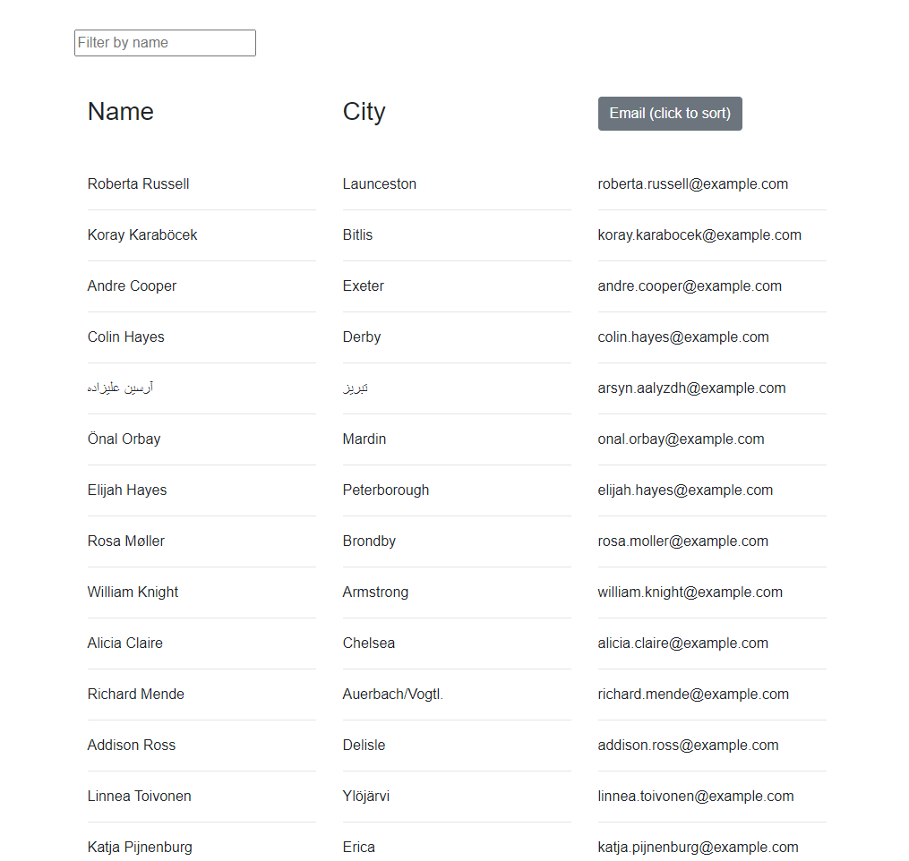

# 19_React

## License
   
  

  ## Description

This is an application made with React. Employee information is pulled from a JSON file. It displays first names, last names, and emails. First names can be sorted by typing in the input field and last names by clicking on "Last Name".

## Usage

To use this app go to the deployed site. You can search for an employee by name to sort the list by first names. Clickling last name will sort last names top to bottom.

  ## Link

  Deployed Application: https://sethglenn.github.io/19_React/

  ## Images

 ## Questions

 [github.com/sethglenn](https://github.com/sethglenn)

 Contact me at my github profile above for any inquiries you may have.